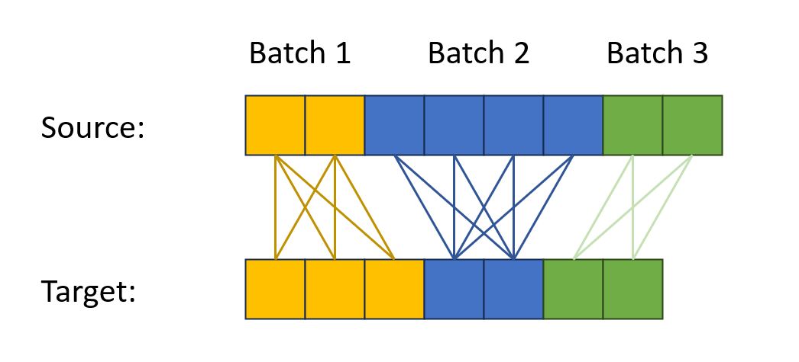

# Scatter optimal transport

Compute the optimal transport for batched data of different sizes. 
This can be used, for example, for point cloud comparison,
where the number of points is different for each point cloud.


 

### Requirement
1) Pytorch
1) [pytorch_scatter](https://github.com/rusty1s/pytorch_scatter)


### Installation
```
git clone https://github.com/wzm2256/ScatterOT
cd ScatterOT
pip install -e .
```


### Usage

Currently, we only support sinkhorn_log,
which is equivalent to the ``ot.bregman.sinkhorn_log`` function in the [POT](https://pythonot.github.io/index.html) library.
A verification of the equivalence:
```cmd
pip install pot scipy
python -m ScatterOT.ot
```

A toy example:
```python
from ScatterOT.ot import sinkhorn_log
from ScatterOT import utils
import torch

# source point cloud for 1st and 2nd batch
x1 = torch.randn(4, 3) + 5
x2 = torch.randn(5, 3) - 5

# target point cloud for 1st and 2nd batch
y1 = torch.randn(2, 3)
y2 = torch.randn(7, 3)

# specify which batch each point belongs to
batch_a = torch.tensor([0] * x1.shape[0] + [1] * x2.shape[0])
batch_b = torch.tensor([0] * y1.shape[0] + [1] * y2.shape[0])

# We provide a helper function to compute the distance matrix
M, M_i, M_j = utils.cdist(torch.cat([x1, x2], dim=0), torch.cat([y1, y2], dim=0), batch_a, batch_b)

# The distance matrix and its indices can then be used in sinkhorn_log
out = sinkhorn_log(None, None, batch_a, batch_b, M, M_i, M_j, eps)

out1 = torch.sparse_coo_tensor(torch.stack([M_i, M_j], dim=0), out, (batch_a.shape[0], batch_b.shape[0])).to_dense()
print('-------------------')
print('ScatterOT results:')
with np.printoptions(precision=3, suppress=True):
    print(out1.cpu().numpy())

```


### License
This project is released under the MIT License.

